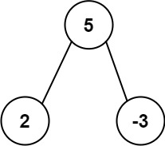
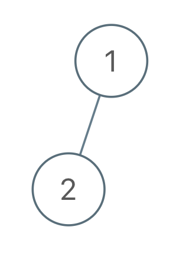

# 二叉树


## 基本概念和常规操作


**二叉树节点结构：**

```c++
template<class T>
struct Node{
    T val;
    Node *left;
    Node *right;
    Node(T val, Node<T> *left= nullptr, Node<T>*right=nullptr):val(val), left(left),right(right){}
};
```

**基本问题：**

1. 用递归、非递归两种方式实现二叉树的先序、中序和后序遍历；
2. 直观打印二叉树；
3. 完成二叉树的宽度优先遍历（常见题目：求一棵二叉树的宽度）

**先序遍历：** 根、左、右

**中序遍历：** 左、根、右

**后序遍历：** 左、右、根


**佐老哥解释：**


**递归序：**

每个节点都会遍历三次，形成的序列为：1，2，4，4，4，2，5，5，5，2，1，3，6，6，6，3，7，7，7，3，1

```c++
void f(Node *tree){
    if(tree == nullptr) return;
    else{
        //1
        f(tree->left);
        //2
        f(tree->right);
        //3
    }
}
```

**先序遍历：** 第一次到节点打印：1，2，4，5，3，6，7

**中序遍历：** 第二次到节点打印：4，2，5，1，6，3，7

**后序遍历：** 第三次到节点打印：4，5，2，6，7，3，1

```c++
template<class T>
void preOrderRecur( Node<T> *tree){
    if(!tree) return ;
    cout<<tree->val<<'\t';
    preOrderRecur(tree->left);
    preOrderRecur(tree->right);
}

template<class T>
void inOrderRecur(Node<T> *tree){
    if(!tree) return ;
    inOrderRecur(tree->left);
    cout<<tree->val<<"\t";
    inOrderRecur(tree->right);
}
template<class T>
void postOrdRecur(Node<T> *tree){
    if(!tree) return ;
    postOrdRecur(tree->left);
    postOrdRecur(tree->right);
    cout<<tree->val<<"\t";
}
//非递归实现
/*
栈：在深度上递归的感觉。
*/
template<class T>
void preOrderIter(Node<T> *tree){
    stack<Node<T>*> tmp_stack;
    tmp_stack.push(tree);
    Node<T> *current;
    while (!tmp_stack.empty()){
        current = tmp_stack.top();
        cout<<current->val<<"\t";
        tmp_stack.pop();
        if(current->right) tmp_stack.push(current->right);
        if(current->left) tmp_stack.push(current->left);
    }
    //从压站顺序上来看，是根右左
}

template<class T>
void postOrderIter(Node<T> *tree){
    stack<Node<T> *> first;
    stack<Node<T> *> second;
    Node<T> *current;
    first.push(tree);
    while (!first.empty()){
        current = first.top();
        first.pop();
        if(current->left) first.push(current->left);
        if(current->right) first.push(current->right);
        second.push(current);
    }
    while (!second.empty()){
        cout<<second.top()->val<<"\t";
        second.pop();
    }
    //需要左右根，前序遍历从压站顺序上来看，是根右左，我们再反一下就是左右根，用什么反？栈！！！
}


template <class  T>
void inOrderIter(Node<T> *tree){
    // 思路：如果有左孩子，左孩子一直进栈，直到没有；然后开始弹出，弹出就打印，然后如果有右孩子，指针跑到右孩子上去，周而复始。
    stack<Node<T>*> tmp;
    Node<T> *current = tree;
    while (current || !tmp.empty()){
        if(current) {
            tmp.push(current);
            current = current->left;
        }
        else{
            current = tmp.top();
            tmp.pop();
            cout<<current->val<<"\t";
            current = current->right;
        }

    }
}
```


**中序示意图：** 左，根，右。（虽然永远是先左再头，但是刚好是这样遍历的）


### 1. 获取最大层数

```c++
//统计最大宽度,用哈希表记录当前层数和当前节点数；
template<class T>
int maxWidth(Node<T> *tree){
    queue<Node<T>*>my;
    unordered_map<Node<T>*, int> levelMap;
    int current_level = 1;
    int current_node = 0;
    int maxNode = 0;
    levelMap[tree] = 1;
    my.push(tree);
    Node<T>*current;
    while (!my.empty()){
        current = my.front();
        my.pop();
        int level = levelMap[current];
        if(level == current_level){
            current_node++;
        }else{
            maxNode = maxNode > current_node ? maxNode : current_node;
            current_node = 1;
            current_level++;
        }
        if(current->left){
            levelMap[current->left] = current_level + 1;
            my.push(current->left);
        }
        if(current->right){
            levelMap[current->right] = current_level + 1;
            my.push(current->right);
        }
    }
    maxNode = maxNode > current_node ? maxNode : current_node; //别忘了最后也要比较一下！
    return maxNode;
}
//不用hash table的方法记得学会！！！！

```


### 2. 如何判断一棵二叉树是否是搜索二叉树(Binary Search Tree, BST)？

**定义：** 每一棵子树，左树都比它小，右树都比它大；

**做法：** 中序遍历，一定是升序的(左根右)；

**关键：** 思考树的特点和我们熟悉的哪种遍历规则比较相似；

```c++
//recursive method;
template<class T>
bool isBST(Node<T> *root){
    if(!root) return true;
    static preValue = INT32_MIN; //静态变量不会被再次初始化的；
    bool isLeftBst = isBST(root->left);
    if(!isLeftBst) return false;
    if(root->val <= preValue) return false;
    else preValue = root->val;
    return isBST(root->right);
}
// 递归方法2， 比较蠢。
template<class T>
bool isBinarySearchTree2(Node<T> *root){
    vector<Node<T>*> list;
    inOrderInsert(root, list);
    for(int i=1;i<list.size();i++){
        if(list[i-1]->val >= list[i]->val) return false;
    }
    return true;
}

template<class T>
void inOrderInsert(Node<T> *root, vector<Node<T>*> list){
    if(!root) return ;
    inOrderRecur(root->left);
    list.push_back(root);
    inOrderRecur(root->right);
}
// 非递归方法，还是在中序遍历上改
template<class T>
bool isBinarySearchTree3(Node<T> *root){
    if(!root) return true;
    stack<Node<T>*> tmp_stack;
    Node<T> *current = root;
    int preValue = INT32_MIN;
    while (current || !tmp_stack.empty()){
        if(current){
            tmp_stack.push(current);
            current = current->left;
        }else{
            current = tmp_stack.top();
            tmp_stack.pop();
            if(current->val <= preValue) return false;
            else preValue = current->val;
            current = current->right;
        }
    }
    return true;
}

//套路解法
/*
我要判断它是否是一个搜索树，对于每个节点为头节点的子树：
我需要向左树要：
1.它是不是个搜索树？
2.它的所有节点的最大值是多少？
我需要向右树要：
1.它是不是搜索树？
2.它的所有节点的最小值时多少？
有了这些信息：
我就能通过判断 我是不是比左边最大还大，比右边最小还小。

这时候就左右要的信息矛盾怎么办？都保留呗！
*/
template<class T>
bool isBinarySearchTree4(Node<T> *root){
    return isBinarySearchTreeNew(root).isBST;
}
struct BSTStruct{
        bool isBST;
        int max_val;
        int min_val;
        BSTStruct(bool isBST,int min_val=INT32_MAX,int max_val=INT32_MIN):isBST(isBST), min_val(min_val),max_val(max_val){}
};
template<class T>
BSTStruct isBinarySearchTreeNew(Node<T> *root){
    if(!root) return BSTStruct(true);
    BSTStruct left = isBinarySearchTreeNew(root->left);
    BSTStruct right = isBinarySearchTreeNew(root->right);
    if(!left.isBST || !right.isBST) return BSTStruct(false);
    if(root->val <= left.max_val) return BSTStruct(false);
    if(root->val >= right.min_val) return BSTStruct(false);
    int max_val = max(max(left.max_val, right.max_val), root->val);
    int min_val = min(min(left.min_val, right.min_val), root->val);
    return BSTStruct(true, min_val, max_val);
}
```

### 3. 如何判断一棵二叉树是完全二叉树？

使用层次（宽度）遍历；

* 任意节点，如果有右孩子，没有左孩子，返回false；
* 第一个条件不违规的条件下，如果遇到了第一个左右孩子不双全的情况，那么接下来左右节点都是叶节点；

```c++
template<class T>
bool isCompleteBinaryTree(Node<T> *root){
    if(!root) return true;
    queue<Node<T>*> my_queue;
    my_queue.push(root);
    Node<T> *current;
    bool isLeaf = false;
    while (!my_queue.empty()){
        current = my_queue.front();
        my_queue.pop();
        if(current->right && !current->left) return false;
        if(isLeaf && (current->left || current->right)) return false;
        if(current->left) my_queue.push(current->left);
        if(current->right) my_queue.push(current->right);
        if(!current->left || !current->right) isLeaf = true;
    }
    return true;
}
```


### 4. 如何判断一棵二叉树是否是满二叉树？

```c++
struct NodeAndHeightStruct{
    int nodes;
    int heights;
    NodeAndHeightStruct(int nodes, int heights):nodes(nodes), heights(heights){}
};

template<class T>
bool isFullBinaryTree(Node<T> *root){
    if(!root) return true;
    NodeAndHeightStruct res = isFullBinaryTreeSub(root);
    int nodes = res.nodes;
    int heights = res.heights;
    // nodes == 2^height - 1
    return nodes == ((1 << heights)-1);
}


template<class T>
NodeAndHeightStruct isFullBinaryTreeSub(Node<T> *root){
    if(!root) return NodeAndHeightStruct(0, 0);
    NodeAndHeightStruct left = isFullBinaryTreeSub(root->left);
    NodeAndHeightStruct right = isFullBinaryTreeSub(root->right);
    int nodes = left.nodes + right.nodes + 1;
    int heights = max(left.heights, right.heights) + 1;
    return NodeAndHeightStruct(nodes, heights);
}
```

### 5. 如何判断一棵二叉树是否是平衡二叉树？（二叉树题目套路）

**套路：** 理清我要向左树要什么信息，向右树要什么信息，然后有了这些信息后我要怎么做；

**什么时候用套路：** 就是能通过向左树要信息，右树要信息，然后结合自身节点信息把题解了的类型。（树形DP）

**定义：** 每一棵子树，左树和右树的高度差，不会超过1；

如果以$x$为头节点的树是个平衡树，那么需要满足：

* 它的左子树是个平衡二叉树，它的右子树是个平衡二叉树；
* 它的左子树的高度和它的右子树的高度相差不超过1；

我们需要每次知道：以当前节点的为根节点的高度和以它为节点是不是个平衡树，需要两个信息，我们可以用一个struct来存储；

 ```c++
 
 template<class T>
 bool isBalanceTree(Node<T>*root){
     return isBalance(root).isBalance;
 }
 
 struct NewType {
         int height;
         bool isBalance;
         NewType(int height, bool isBalance):height(height), isBalance(isBalance){}
     };
 template <class T>
 NewType isBalance(Node<T> *root){
     if(!root) return NewType(0, true);
     NewType left =isBalance(root->left);
     NewType right = isBalance(root->right);
     bool balance = left.isBalance && right.isBalance && (abs(left.height - right.height)<=1);
     int height = max(left.height, right.height) + 1;
     return NewType(height, balance);
 }
 ```


### 6. 给定两个二叉树的节点node1和node2， 找到他们的最近公共祖先

前提：这两个节点一定在这棵树上。

**定义：** 即node1和node2往上，第一个汇聚的点；


```c++
//找出每个节点的爹，然后node1的所有爹爹放到一个hashset中，然后遍历node2的爹爹们，到第一个在那个hashset的爹爹，就是他们共同的爹。
template<class T>
Node<T> * getCommonAncestor(Node<T> *root, Node<T> *node1, Node<T> *node2){
    unordered_map<Node<T> *, Node<T> *> fatherMap;
    fatherMap[root] = root;
    commonAncestorProcess(root, fatherMap);
    unordered_set<Node<T> *> n1;
    while (fatherMap[node1] != root){
        n1.insert(node1);
        node1 = fatherMap[node1];
    }
    n1.insert(node1);

    while (n1.find(node2) == n1.end()){
        node2 = fatherMap[node2];
    }
    return node2;
}
//注意参数要用引用拷贝，hastset是以值拷贝传参的，但是我们需要的是一个引用。
template<class T>
void commonAncestorProcess(Node<T> *root, unordered_map<Node<T>*, Node<T>*>& map){
    if(!root) return;
    map[root->left] = root;
    map[root->right] = root;
    commonAncestorProcess(root->left, map);
    commonAncestorProcess(root->right, map);
}

//方法2
/*
情况：
1）node1是node2的最低公共祖先或者node2是node1的最低公共祖先
2) 不互相为最低公共祖先，需要往上汇聚才能找到
*/
template<class T>
Node<T> * getCommonAncestor2(Node<T> *root, Node<T> *node1, Node<T> *node2){
    if(root == nullptr||root == node1 || root == node2) return root;
    Node<T> *leftCommon = getCommonAncestor2(root->left, node1, node2); //向左边要答案
    Node<T> *rightConmon = getCommonAncestor2(root->right, node1, node2);//向右边要答案
    if(leftCommon!= nullptr && rightConmon!= nullptr) return root;
    return leftCommon ? leftCommon : rightConmon;
}
```


### 7.在二叉树中找到一个节点的后继节点


```c++
struct Node{
    int val;
    Node *left;
    Node *right;
    Node *parent;
    Node(int val):val(val){}
}
```

**题目：** 假设有一棵Node类型的节点组成的二叉树，树中每个节点的parent指针都正确地指向自己的父节点，头节点的parent为null。只给一个在二叉树中的某个节点node，请实现返回node的后继节点的函数。**在二叉树的中序遍历的序列中，node的下一个节点叫做node的后继节点。**

**做法：**

* X有右树的时候，他的后继就是右树最左边的节点；
* X没有右树的时候，找第一个是parent的左孩子的节点。


```c++
struct NewNode{
        int val;
        NewNode *left;
        NewNode *right;
        NewNode *parent;
        NewNode(int val, NewNode * left= nullptr, NewNode *right= nullptr, NewNode *parent= nullptr):val(val), left(left), right(right),parent(parent){}
};

NewNode *getSuccessorNode(NewNode *node){
    if(!node) return nullptr;
    if(node->right) {//有右树，后继节点就是其右树的最左边；
        node = node->right;
        while(node->left) node = node->left;
        return node;
    } else{
        //没有右树，那就往上找，知道这个节点是它父亲的左孩子。
        NewNode *parent = node->parent;
        while (parent && parent->left != node){
            node = parent;
            parent = node->parent;
        }
        return parent;
    }
}

```


### 8.二叉树的序列化和反序列化

**题目：** 就是内存里的一棵树如何变成字符串的形式，又如何从字符串形式变成内存里的树。

**备注：** 297. Serialize and Deserialize Binary Tree[hard]

**解法：**

* 可以使用先序遍历，然后将树存储为字符串；


```c++
//用先序遍历
template<class T>
string serialByPre(Node<T> *root){
    //根左右
    if(!root) return "#_";
    string res = to_string(root->val) +"_";
    res += serialByPre(root->left);
    res += serialByPre(root->right);
    return res;
}
//字符串split函数，好好学学。
void split(const string &s, vector<string> &tokens, const string & delimiters=" "){
    string::size_type lastPos = s.find_first_not_of(delimiters, 0);
    string::size_type pos = s.find_first_of(delimiters, lastPos);
    while (string::npos != pos || string::npos != lastPos){
        tokens.push_back(s.substr(lastPos, pos - lastPos));
        lastPos = s.find_first_not_of(delimiters, pos);
        pos = s.find_first_of(delimiters, lastPos);
    }
}
template<class T>
Node<T> *reconPreOrder(queue<string> &tmpQueue){
    string val = tmpQueue.front();
    tmpQueue.pop();
    if(val == "#") return nullptr;
    Node<T>* head = new Node<T> (atoi(val.c_str()));
    head->left = reconPreOrder<T>(tmpQueue);
    head->right = reconPreOrder<T>(tmpQueue);
    return head;
}

template<class T>
Node<T>* reconByPreString(string preStr){
    vector<string> values;
    split(preStr, values, "_");
    queue<string> tmpQueue;
    for(auto s: values) tmpQueue.push(s);
    Node<T>*res = reconPreOrder<T>(tmpQueue);
    return res;
}

//自己写的函数，判断是不是一模一样的树
template<class T>
bool saveTree(Node<T> *root1, Node<T> *root2){
    if(!root1 && root2 || root1 && !root2) return false;
    if(!root1 && !root2) return true;
    if(root1->val != root2->val) return false;
    return saveTree(root1->left, root2->left) && saveTree(root1->right, root2->right);
}
```


### 9.纸对折痕迹打印

纸条对折一次，中间产生凹痕，再对折从上到下会产生“凹 凹 凸”的痕迹，对折$N$次后产生的折痕从上到下是什么？


```c++
void printProcess(int i, int N, bool down){
    if(i > N) return;
    printProcess(i+1, N, true);
    cout<<(down ? "凹":"凸")<<"\t";
    printProcess(i+1, N, false);
 }
void printAllFolds(int N){
    printProcess(1, N, true);
}

```


## Leetcode 习题


#### 96. Unique Binary Search Trees[Medium]


**核心思想：** 通过个例归纳出公式，进行递归。（子问题重复，采用DP）


```c++
class Solution {
public:
    int numTrees(int n) {
        if(n <= 1) return 1;
        int ans = 0;
        for(int i = 1; i <= n; i++) 
            ans += numTrees(i-1) * numTrees(n-i);
        return ans;
    }
};

//子问题重复，进行DP
class Solution {
public:
    int numTrees(int n) {
        int res = 0;
        vector<int> dp(20);
        dp[1] = 1;
        dp[0] = 1;
        for(int j=2;j<=n;j++){
            for(int i=1;i<=j;i++){
                dp[j] += dp[i-1] * dp[j - i];
        	}     
    	}
      return dp[n];  
    }
};
```

#### 98. Validate Binary Search Tree[Medium]

**题目：** Given the `root` of a binary tree, *determine if it is a valid binary search tree (BST)*.

A **valid BST** is defined as follows:

- The left subtree of a node contains only nodes with keys **less than** the node's key.
- The right subtree of a node contains only nodes with keys **greater than** the node's key.
- Both the left and right subtrees must also be binary search trees.

```c++
.//中序遍历，注意这个prev初始化的处理方式，可以用空指针。
class Solution {
public:
    bool isValidBST(TreeNode* root) {
        stack<TreeNode*> my;
        TreeNode * current = root;
        TreeNode *prev = nullptr;
        while(current || !my.empty()){
            if(current){
                my.push(current);
                current = current->left;
            }else{
                current = my.top();
                if(prev && current->val <= prev->val) return false;
                prev = current;
                my.pop();
                current = current->right;
            }
        }
        return true;
    }
};

//中序遍历递归，左树需要知道max，右树需要知道min。可以按照套路定义结构，也可以用引用记录。
class Solution {
public:
    bool isValidBST(TreeNode* root) {
        return help(root, LONG_MIN, LONG_MAX);
    }
 
    bool help(TreeNode* root, long min, long max){
        if(!root)   return true;
        if(root->val <= min || root->val >= max)  return false;
        return help(root->left, min, root->val) && help(root->right, root->val, max);
    }
};
```


#### 95.Unique Binary Search Trees II[Medium]

**题目：** Given an integer `n`, return *all the structurally unique **BST'**s (binary search trees), which has exactly* `n` *nodes of unique values from* `1` *to* `n`. Return the answer in **any order**.


```c++
//自己写的，以每个节点为头节点，进行递归。【最高赞也是这么写的】
class Solution {
public:
    vector<TreeNode*> generateTrees(int n) {
        return generate(1, n);
    }
    vector<TreeNode *> generate(int left, int right){
        if(left == right) return vector<TreeNode *>{new TreeNode(left)};
        if(left > right) return vector<TreeNode *>{nullptr};
         vector<TreeNode *> res;
        for(int i=left; i<=right;i++){
            vector<TreeNode*> leftTree = generate(left, i-1);
            vector<TreeNode*> rightTree = generate(i+1, right);
            for(int j=0;j<leftTree.size();j++){
                for(int k=0;k<rightTree.size();k++){
                    TreeNode *root = new TreeNode(i, leftTree[j], rightTree[k]);
                    res.push_back(root);
                }
            }  
        }
        return res; 
    }
};


//基于DP的方法。
vector<TreeNode*> generateTrees(int n) {
        vector<TreeNode *> res;
        if(n>0)
            res.push_back(nullptr);
        for(int i=1;i<=n;i++) {
            vector<TreeNode *> temp;
            int sz=res.size();
            for(int j=0;j<sz;j++) {
            	TreeNode *oldT=res[j],*subr=oldT;
				TreeNode *newTree=new TreeNode(i);
				newTree->left=oldT;
                res[j]=newTree;
                TreeNode tnode(i);
				while(subr) {
                    TreeNode *rchild=subr->right,*newnode=&tnode;
                    newnode->left=rchild;
                    subr->right=newnode;
                    res.push_back(CloneTree(oldT));
                    subr->right=rchild;
                    subr=subr->right;
				}
            }
        }
		return res;
    }
    TreeNode *CloneTree(TreeNode *root) {
        if(!root)
            return nullptr;
        TreeNode *newR=new TreeNode(root->val);
        newR->left=CloneTree(root->left);
        newR->right=CloneTree(root->right);
        return newR;
    }
```

**DP：** the  basic idea is that we can construct the result of $n$ node tree just from the result of n-1 node tree.
Here's how we do it: only 2 conditions: 

* The $n$-th node is the new root, so `newroot->left = oldroot;`
* the $n$-th node is not root, we traverse the old tree, every time the node in the old tree has a right child, we can perform: `old node->right = nth node, nth node ->left = right child;` and when we reach the end of the tree, don't forget we can also add the $n$-th node here.
  One thing to notice is that every time we push a TreeNode in our result, I push the clone version of the root, and I recover what I do to the old node immediately. This is because you may use the old tree for several times.

#### 96. Flatten Binary Tree to Linked List[Medium]

Given the `root` of a binary tree, flatten the tree into a "linked list":

- The "linked list" should use the same `TreeNode` class where the `right` child pointer points to the next node in the list and the `left` child pointer is always `null`.

- The "linked list" should be in the same order as a [**pre-order** **traversal**](https://en.wikipedia.org/wiki/Tree_traversal#Pre-order,_NLR) of the binary tree.

  

```c++
//很直接的思路：左边展平接到root右边，右边展平再续上。
class Solution {
public:
    void flatten(TreeNode* root) {
        if(!root) return;
        TreeNode *left = root->left;
        TreeNode *right = root->right;
        root->left = nullptr;
        flatten(left);
        flatten(right);
        root->right = left;
        TreeNode *current = root;
        while(current->right) current = current->right;
        current->right = right;
    }
};
//时间复杂度：master 公式：T(N)=2T(N/2) + O(N); T(N)=N log N
//空间复杂度：O（N）

//牛逼的做法我没看懂
class Solution {
public:
    TreeNode *prev=nullptr;
    void flatten(TreeNode* root) {
        if(!root) return;
        flatten(root->right);
        flatten(root->left);
        root->right = prev;
        root->left = nullptr;
        prev = root;
    }
};
```

#### 116. Populating Next Right Pointers in Each Node[Medium]

You are given a **perfect binary tree** where all leaves are on the same level, and every parent has two children. The binary tree has the following definition:

```c++
struct Node {
  int val;
  Node *left;
  Node *right;
  Node *next;
}
```

Populate each next pointer to point to its next right node. If there is no next right node, the next pointer should be set to `NULL`.

Initially, all next pointers are set to `NULL`.

 

**Example 1:**


```markdown
Input: root = [1,2,3,4,5,6,7]
Output: [1,#,2,3,#,4,5,6,7,#]
Explanation: Given the above perfect binary tree (Figure A), your function should populate each next pointer to point to its next right node, just like in Figure B. The serialized output is in level order as connected by the next pointers, with '#' signifying the end of each level.
```

```c++
//关键点，用nullptr可以在queue中标记深度信息；时间和空间复杂度都是O(N)
class Solution {
public:
    Node* connect(Node *root) {
        if (!root) return root; //Edge Case
        queue<Node*> q;
        //Trick: Push nullptr to maintain depth information
        q.push(root);
        q.push(nullptr);
        Node* current;
        while(!q.empty()){
            current = q.front();
            q.pop();
            if (current==nullptr) {
                if (q.size() > 0) q.push(nullptr);
            }
            else{
                current->next = q.front();
                if(current->left!=nullptr) q.push(current->left);
                if(current->right!=nullptr) q.push(current->right);
            }
        }
        return root;
    } 
};
//时间O(N),空间：O(1);思路很清晰；
void connect(TreeLinkNode *root) {
        TreeLinkNode* level_start = root;
        while(level_start!=NULL)
        {   //curr is the first node in that level
            TreeLinkNode* curr = level_start;
            //Keep going to the right in that level
            while(curr!=NULL)
            {
                if(curr->left!=NULL) curr->left->next=curr->right;
                if(curr->right!=NULL && curr->next!=NULL) curr->right->next=curr->next->left;
                curr = curr->next;
            }
            level_start=level_start->left;
        }
        
    }
//递归版本
class Solution {
public:
    Node* connect(Node *root) {
        if (!root) return root; //Edge Case
        if(root->left) root->left->next = root->right;
        if(root->right && root->next) root->right->next = root->next->left;
        connect(root->left);
        connect(root->right);
        return root; 
    } 
};
```


#### 105. Construct Binary Tree from Preorder and Inorder Traversal[Medium]

Given two integer arrays `preorder` and `inorder` where `preorder` is the preorder traversal of a binary tree and `inorder` is the inorder traversal of the same tree, construct and return *the binary tree*.

 

**Example 1:**


```
Input: preorder = [3,9,20,15,7], inorder = [9,3,15,20,7]
Output: [3,9,20,null,null,15,7]
```

```c++
//用先序遍历确定头节点，然后用中序遍历的结果确定左右子树两部分所包含的节点数目，并递归构建树。
class Solution {
public:
    TreeNode* buildTree(vector<int>& preorder, vector<int>& inorder) {
        return buildTreeHelper(preorder, inorder, 0, 0, inorder.size()-1);
        
    }
    
    TreeNode *buildTreeHelper(vector<int>& preorder, vector<int>& inorder, int preStart, int inStart, int inEnd){
        if(inEnd < inStart || preStart > preorder.size()-1) return nullptr;
        TreeNode *root = new TreeNode(preorder[preStart]);
        int index=0;
        for(int i=inStart; i<=inEnd; i++){
            if(root->val == inorder[i]){
                index = i;
                break;
            }
        }
        root->left = buildTreeHelper(preorder, inorder, preStart+1, inStart, index-1);
        root->right = buildTreeHelper(preorder, inorder, preStart + index-inStart + 1,  index + 1, inEnd);
        return root;
    }
};
```


#### 106. Construct Binary Tree from Inorder and Postorder Traversal[Medium]

Given two integer arrays `inorder` and `postorder` where `inorder` is the inorder traversal of a binary tree and `postorder` is the postorder traversal of the same tree, construct and return *the binary tree*.

 

**Example 1:**


```
Input: inorder = [9,3,15,20,7], postorder = [9,15,7,20,3]
Output: [3,9,20,null,null,15,7]
```

**Example 2:**

```
Input: inorder = [-1], postorder = [-1]
Output: [-1]
```


```c++
//我的解法，后续遍历最后一个节点为头节点。然后划分哪些是左子树上的点，哪些是右子树上的点，同时记录头节点；
class Solution {
public:
    TreeNode* buildTree(vector<int>& inorder, vector<int>& postorder) {
        return build(inorder, postorder, postorder.size()-1, 0, inorder.size()-1);
        
    }
    
    TreeNode *build(vector<int>& inorder, vector<int>& postorder, int root_index, int inStart, int inEnd){
        if(inStart > inEnd || root_index < 0) return nullptr;
        if(inStart == inEnd) return new TreeNode(postorder[root_index]);
        TreeNode *root = new TreeNode(postorder[root_index]);
        int index;
        for(int i=0;i<inorder.size();i++)
            if(inorder[i] == root->val)
                index = i;
        root->left = build(inorder, postorder, root_index- inEnd + index-1, inStart, index-1);
        root->right = build(inorder, postorder, root_index-1, index + 1, inEnd);
        return root;
    }
};
```


#### 112. Path Sum[Easy]

Given the `root` of a binary tree and an integer `targetSum`, return `true` if the tree has a **root-to-leaf** path such that adding up all the values along the path equals `targetSum`.

A **leaf** is a node with no children.

 

**Example 1:**


```
Input: root = [5,4,8,11,null,13,4,7,2,null,null,null,1], targetSum = 22
Output: true
Explanation: The root-to-leaf path with the target sum is shown.
```


```c++
//recursive solution
class Solution {
public:
    bool hasPathSum(TreeNode* root, int targetSum) {
        if(!root) return false;
        if(!root->left && !root->right) return targetSum == root->val;
        return hasPathSum(root->left, targetSum - root->val) || hasPathSum(root->right, targetSum - root->val);   
    }
};

// preorder and hashmap
class Solution {
public:
    bool hasPathSum(TreeNode* root, int targetSum) {
        if(!root) return false;
        stack<TreeNode *> my_stack;
        TreeNode *current;
        unordered_map<TreeNode *, int> map;
        map[root] = root->val;
        my_stack.push(root);
        int val;
        while(!my_stack.empty()){
            current = my_stack.top();
            my_stack.pop();
            val = map[current];
            //如果是根节点并且满足和，才返回true
            if(!current->left && !current->right && val == targetSum) return true;
            if(current->right){
                my_stack.push(current->right);
                map[current->right] = val + current->right->val;
            }
            if(current->left){
                my_stack.push(current->left);
                map[current->left] = val + current->left->val;
            }
        }
        return false;
    }    
};
```

#### 113. Path Sum II[Medium]

Given the `root` of a binary tree and an integer `targetSum`, return *all **root-to-leaf** paths where the sum of the node values in the path equals* `targetSum`*. Each path should be returned as a list of the node **values**, not node references*.

A **root-to-leaf** path is a path starting from the root and ending at any leaf node. A **leaf** is a node with no children.

 

**Example 1:**


```
Input: root = [5,4,8,11,null,13,4,7,2,null,null,5,1], targetSum = 22
Output: [[5,4,11,2],[5,8,4,5]]
Explanation: There are two paths whose sum equals targetSum:
5 + 4 + 11 + 2 = 22
5 + 8 + 4 + 5 = 22
```

```c++
//左边搞好，右边搞好，将两个list并起来
class Solution {
public:
    vector<vector<int>> pathSum(TreeNode* root, int targetSum) {
        if(!root) return vector<vector<int>>{};
        if(targetSum == root->val && !root->left && !root->right)
            return vector<vector<int>>{{root->val}};
        vector<vector<int>> left = pathSum(root->left, targetSum - root->val);
        vector<vector<int>> right = pathSum(root->right, targetSum - root->val);
        for(int i=0;i<left.size();i++){
            right.push_back(left[i]);
        }
        for(int i=0;i<right.size();i++){
            right[i].insert(right[i].begin(), root->val);
        }
        return right;     
    }
};
```


#### 437. Path Sum III[Medium]

Given the `root` of a binary tree and an integer `targetSum`, return *the number of paths where the sum of the values along the path equals* `targetSum`.

The path does not need to start or end at the root or a leaf, but it must go downwards (i.e., traveling only from parent nodes to child nodes).

 

**Example 1:**


```
Input: root = [10,5,-3,3,2,null,11,3,-2,null,1], targetSum = 8
Output: 3
Explanation: The paths that sum to 8 are shown.
```

**核心思路：**

* The prefix stores the sum from the root to the current node in the recursion
* The map stores <prefix sum, frequency> pairs before getting to the current node. We can imagine a path from the root to the current node. The sum from any node in the middle of the path to the current node = the difference between the sum from the root to the current node and the prefix sum of the node in the middle.
* We are looking for some consecutive nodes that sum up to the given target value, which means the difference discussed in 2. should equal to the target value. In addition, we need to know how many differences are equal to the target value.
* Here comes the map. The map stores the frequency of all possible sum in the path to the current node. If the difference between the current sum and the target value exists in the map, there must exist a node in the middle of the path, such that from this node to the current node, the sum is equal to the target value.
* Note that there might be multiple nodes in the middle that satisfy what is discussed in 4. The frequency in the map is used to help with this.
* Therefore, in each recursion, the map stores all information we need to calculate the number of ranges that sum up to target. Note that each range starts from a middle node, ended by the current node.
* To get the total number of path count, we add up the number of valid paths ended by EACH node in the tree.
* Each recursion returns the total count of valid paths in the subtree rooted at the current node. And this sum can be divided into three parts:
  \- the total number of valid paths in the subtree rooted at the current node's left child
  \- the total number of valid paths in the subtree rooted at the current node's right child
  \- the number of valid paths ended by the current node


The interesting part of this solution is that the prefix is counted from the top(root) to the bottom(leaves), and the result of total count is calculated from the bottom to the top :D

```c++
//这道题个人感觉挺难，就是要找好如何递归，这里他的递归函数表示含义是：包含当前节点的满足条件的有几个。等于左边+右边+自身。
//好好学习一下这个思路
class Solution {
public:
    int pathSum(TreeNode* root, int targetSum) {
        unordered_map<int, int> map;
        map[0] = 1;
        return helper(root, 0, targetSum, map);    
    }
    
    int helper(TreeNode *node, int sum, int target, unordered_map<int, int> &map){
        if(!node) return 0;
        sum += node->val;
        int numsToNodes = 0;
        if(map.find(sum - target) != map.end()){
            numsToNodes = map[sum - target];
        }
        map[sum] = map.find(sum)!= map.end() ? map[sum]+1 : 1;
        int res = numsToNodes + helper(node->left, sum, target, map) + helper(node->right, sum, target, map);
        map[sum] = map[sum] - 1;
        return res;
    }
};
```


#### 199. Binary Tree Right Side View

Given the `root` of a binary tree, imagine yourself standing on the **right side** of it, return *the values of the nodes you can see ordered from top to bottom*.

 

**Example 1:**


```
Input: root = [1,2,3,null,5,null,4]
Output: [1,3,4]
```

```c++
//层次遍历解法
class Solution {
public:
    vector<int> rightSideView(TreeNode* root) {
        if(!root) return vector<int>{};
        queue<TreeNode *> my;
        TreeNode *current;
        vector<int> res;
        my.push(root);
        while(!my.empty()){
            int qsize = my.size();
            while(qsize--){
                current = my.front();
                my.pop();
                if(qsize == 0) res.push_back(current->val);
                if(current->left) my.push(current->left);
                if(current->right) my.push(current->right);
            }
        }
        return res;
    } 
};

//递归做法，比较神奇
class Solution {
public:
    vector<int> rightSideView(TreeNode* root) {
        vector<int> res;
        getRes(root, res, 0);
        return res;
    }
    void getRes(TreeNode *root, vector<int> &result, int depth){
        if(!root) return;
        if(result.size() == depth)
            result.push_back(root->val);
        getRes(root->right, result, depth + 1); //如果这一步添加了，下面左边的就不会再添加，这个思路很牛！
        getRes(root->left, result, depth + 1);
    }
};
```


#### 222. Count Complete Tree Nodes

Given the `root` of a **complete** binary tree, return the number of the nodes in the tree.

According to **[Wikipedia](http://en.wikipedia.org/wiki/Binary_tree#Types_of_binary_trees)**, every level, except possibly the last, is completely filled in a complete binary tree, and all nodes in the last level are as far left as possible. It can have between `1` and `2h` nodes inclusive at the last level `h`.

Design an algorithm that runs in less than `O(n)` time complexity.

 

**Example 1:**


```
Input: root = [1,2,3,4,5,6]
Output: 6
```


```c++
//我的做法，时间复杂度: O(N)
class Solution {
public:
    int countNodes(TreeNode* root) {
        if(!root) return 0;
        return 1 + countNodes(root->left) + countNodes(root->right);
        
    }
};

```

老哥们的：

```c++
//太牛了[改了一下，和解释有点不符合，解释的height函数是求解子树高度的]
class Solution {
public:
    int height(TreeNode *root){
        return root ? 1 + height(root->left) : 0;
    }
    int countNodes(TreeNode* root) {
        int h = height(root);
        return h == 0 ? 0 : height(root->right) == h-1 ? (1 << (h-1)) + countNodes(root->right) :(1<<(h-2)) + countNodes(root->left);   
    }
};
```

**Explanation**


The height of a tree can be found by just going left. Let a single node tree have height 0. Find the height $h$ of the whole tree. If the whole tree is empty, i.e., has height -1, there are 0 nodes.

Otherwise check whether the height of the right subtree is just one less than that of the whole tree, meaning left and right subtree have the same height.

- If yes, then the last node on the last tree row is in the right subtree and the left subtree is a full tree of height $h-1$. So we take the $2^h-1$ nodes of the left subtree plus the 1 root node plus recursively the number of nodes in the right subtree.
- If no, then the last node on the last tree row is in the left subtree and the right subtree is a full tree of height $h-2$. So we take the $2^{(h-1)}-1$ nodes of the right subtree plus the 1 root node plus recursively the number of nodes in the left subtree.

Since I halve the tree in every recursive step, I have $O(log(n))$ steps. Finding a height costs $O(log(n))$. So overall $O(log(n)^2)$.


#### 230. Kth Smallest Element in a BST

Given the `root` of a binary search tree, and an integer `k`, return *the* `kth` *smallest value (**1-indexed**) of all the values of the nodes in the tree*.

 

**Example 1:**


```
Input: root = [3,1,4,null,2], k = 1
Output: 1
```

```c++
//我的解法，中序遍历 O(n)
class Solution {
public:
    int kthSmallest(TreeNode* root, int k) {
        stack<TreeNode *> tmp;
        TreeNode *current=root;
        int index = 1;
        while(current || !tmp.empty()){
            if(current){
                tmp.push(current);
                current = current->left;
            }else{
                current = tmp.top();
                tmp.pop();
                if(index == k) return current->val;
                index++;
                current = current->right;
            }
        }
        return 0;      
    }
};
//时间复杂度:O(N)
class Solution {
public:
    int kthSmallest(TreeNode* root, int k) {
     
     int nodes = getNodes(root->left);
     if(k <= nodes) return kthSmallest(root->left, k);
     else if(k > nodes + 1) return kthSmallest(root->right, k-nodes-1);
     return root->val;
 }
    int getNodes(TreeNode *root){
        if(!root) return 0;
        return 1 + getNodes(root->left) + getNodes(root->right);
    }
};
//自己写的递归
class Solution {
public:
    int count = 1;
    int kthSmallest(TreeNode* root, int k) {
        if(!root) return -1;
        int left = kthSmallest(root->left, k);
        if(left != -1) return left;
        if(count == k) return root->val;
        count++;
        int right = kthSmallest(root->right, k);
        return right == -1 ? -1 : right;   
 }
};
```


#### 331. Verify Preorder Serialization of a Binary Tree[Medium]

One way to serialize a binary tree is to use **preorder traversal**. When we encounter a non-null node, we record the node's value. If it is a null node, we record using a sentinel value such as `'#'`.


For example, the above binary tree can be serialized to the string `"9,3,4,#,#,1,#,#,2,#,6,#,#"`, where `'#'` represents a null node.

Given a string of comma-separated values `preorder`, return `true` if it is a correct preorder traversal serialization of a binary tree.

It is **guaranteed** that each comma-separated value in the string must be either an integer or a character `'#'` representing null pointer.

You may assume that the input format is always valid.

- For example, it could never contain two consecutive commas, such as `"1,,3"`.

**Note:** You are not allowed to reconstruct the tree.

**Example 1:**

```
Input: preorder = "9,3,4,#,#,1,#,#,2,#,6,#,#"
Output: true
```


```c++
class Solution {
private:
    void split(const string &s, vector<string> &tokens, const string & delimiters=" "){
    string::size_type lastPos = s.find_first_not_of(delimiters, 0);
    string::size_type pos = s.find_first_of(delimiters, lastPos);
    while (string::npos != pos || string::npos != lastPos){
        tokens.push_back(s.substr(lastPos, pos - lastPos));
        lastPos = s.find_first_not_of(delimiters, pos);
        pos = s.find_first_of(delimiters, lastPos);
    }
}
public:
    bool isValidSerialization(string preorder) {
        vector<string> data;
        split(preorder, data, ",");
        // 精彩之处, diff= outDegree - inDegree，null指针提供2出度，0个入度。如果不是二叉树，只能是null造成的。
        int diff = 1;
        for(auto s: data){
            if(--diff <0) return false;
            if(s != "#") diff += 2;
        }
        return diff == 0;
    }
  
};

```

```java
//扩展中序和后序,java代码
public boolean isValidSerialization_PostOrder(String postorder) {
	String[] nodes = postorder.split(",");
	int diff = 1;
	for (String node : nodes) {
		diff--;
		if (!node.equals("#")) diff += 2;
		// Post-Order traversal fail criteria
		if (diff > 0) return false;
	}
	return diff == 0;
}

public boolean isValidSerialization_InOrder(String inorder) {
	String[] nodes = inorder.split(",");
	int diff = 1;
	for (String node : nodes) {
		diff--;
		if (!node.equals("#")) diff += 2;
		// In-Order traversal fail criteria
		if (diff > 1) return false;
	}
	return diff == 0;
}
```


#### 572. Subtree of Another Tree[easy]

Given the roots of two binary trees `root` and `subRoot`, return `true` if there is a subtree of `root` with the same structure and node values of` subRoot` and `false` otherwise.

A subtree of a binary tree `tree` is a tree that consists of a node in `tree` and all of this node's descendants. The tree `tree` could also be considered as a subtree of itself.

 

**Example 1:**


```
Input: root = [3,4,5,1,2], subRoot = [4,1,2]
Output: true
```


```c++
//一个一个节点的和子树对比；
class Solution {
public:
    bool isSubtree(TreeNode* root, TreeNode* subRoot) {
        if(!root && subRoot) return false;
        if(!root && !subRoot) return true;
        if(sameTree(root, subRoot)) return true;
        return isSubtree(root->left, subRoot) || isSubtree(root->right, subRoot);    
    }
    bool sameTree(TreeNode *root1, TreeNode *root2){
        if(!root1 && !root2) return true;
        if(root1 && !root2 || root2 && !root1) return false;
        if(root1->val != root2->val) return false;
        return sameTree(root1->left, root2->left) && sameTree(root1->right, root2->right); 
    }
};
```


#### 623. Add One Row to Tree[Medium]

Given the `root` of a binary tree and two integers `val` and `depth`, add a row of nodes with value `val` at the given depth `depth`.

Note that the `root` node is at depth `1`.

The adding rule is:

- Given the integer `depth`, for each not null tree node `cur` at the depth `depth - 1`, create two tree nodes with value `val` as `cur`'s left subtree root and right subtree root.
- `cur`'s original left subtree should be the left subtree of the new left subtree root.
- `cur`'s original right subtree should be the right subtree of the new right subtree root.
- If `depth == 1` that means there is no depth `depth - 1` at all, then create a tree node with value `val` as the new root of the whole original tree, and the original tree is the new root's left subtree.

 

**Example 1:**


```
Input: root = [4,2,6,3,1,5], val = 1, depth = 2
Output: [4,1,1,2,null,null,6,3,1,5]
```

```c++
//自己写出来的，不容易了哈哈哈
class Solution {
public:
    TreeNode* addOneRow(TreeNode* root, int val, int depth) {
        if(depth == 1) return new TreeNode(val, root, nullptr);
        queue<TreeNode *> my;
        TreeNode *current;
        my.push(root);
        int qsize;
        int level = 1;
        bool flag = false;
        while(!my.empty()){
            qsize = my.size();
            while(qsize--){
                current = my.front();
                if(level == depth - 1){
                    TreeNode *left = new TreeNode(val, current->left, nullptr);
                    TreeNode *right = new TreeNode(val, nullptr, current->right);
                    current->left = left;
                    current->right = right;
                    flag = true;
                }
                if(qsize == 0) level++; //这种遍历方式要熟悉呀，一层一层遍历；
                my.pop();
                if(current->left) my.push(current->left);
                if(current->right) my.push(current->right);
            }
            if(flag) break;
        }
        return root;
    }
};

//别人的
class Solution {
public:
    TreeNode* addOneRow(TreeNode* root, int v, int d) {
        if (d == 0 || d == 1) {
            TreeNode* newroot = new TreeNode(v);
            (d ? newroot->left : newroot->right) = root;
            return newroot;
        }
        if (root && d >= 2) {
            root->left  = addOneRow(root->left,  v, d > 2 ? d - 1 : 1);
            root->right = addOneRow(root->right, v, d > 2 ? d - 1 : 0);
        }
        return root;
    }
};
```


#### 337.House Robber III

The thief has found himself a new place for his thievery again. There is only one entrance to this area, called `root`.

Besides the `root`, each house has one and only one parent house. After a tour, the smart thief realized that all houses in this place form a binary tree. It will automatically contact the police if **two directly-linked houses were broken into on the same night**.

Given the `root` of the binary tree, return *the maximum amount of money the thief can rob **without alerting the police***.

 

**Example 1:**


```
Input: root = [3,2,3,null,3,null,1]
Output: 7
Explanation: Maximum amount of money the thief can rob = 3 + 3 + 1 = 7.
```

**Example 2:**


```
Input: root = [3,4,5,1,3,null,1]
Output: 9
Explanation: Maximum amount of money the thief can rob = 4 + 5 = 9.
```


**思路整理：**

* 首先对于最大价值，我们假设我们有root左子树的最大价值left和右子树的最大价值right,怎么组合成root的最大价值？
  * 根据规则，我们不能选相邻节点，即如果选了偷root的，那我不能偷root->left和root->right，只能隔一代再偷；
  * 如果不偷root，那我们只需要返回偷左边和偷右边的累积价值left + right
* 实现
  * 如果偷了root，我们需要知道在不选root->left和root->right前提下的价值，这时候我们需要知道孙子节点的最大价值。所以整个节点需要维护两个信息：就是包含偷左右孩子的最大价值和不包含左右孩子的最大价值;
  * 那么我的总最大价值就是:`max(root->val + 左孙子价值+右孙子价值， 左孩子价值+右孩子价值)`，即以包不包含当前值为划分点；

```c++
class Solution{
public:
    int rob(TreeNode *root){
        return getMax(root).first;
    }
    pair<int, int> getMax(TreeNode *root){
        // 这个函数用来返回以root为节点的最大价值，返回两个值，第一个表示从当前节点出发的最大价值，第二值表示从他它子孙的出发的最大价值。
        if(!root) return {0, 0};
        pair<int, int> left = getMax(root->left);
        pair<int, int> right = getMax(root->right);
        return {max(root->val + left.second + right.second, left.first + right.first), left.first + right.first};
    }
};

// 朴素思想：我想递归解决，我就想要从左右孩子要结果，根据结果获得答案。（这个过程会超时间）
class Solution{
    public:
    int rob(TreeNode *root){
        if(!root) return 0;
        int val = root->val;
        if(root->left)  val += rob(root->left->left) + rob(root->left->right);
        if(root->right) val += rob(root->right->left) + rob(root->right->right);
        return max(val, rob(root->left) + rob(root->right)); 
    }
};
//有很多的overlap，比如：在解决rob(root),我们会求rob(root->left),rob(root->left->left),而递归中rob(root->left)又再次需要rob(root->left->left)，会出现很多类似的重复求解。可以用dp去记录一些中间结果，怎么记录？hash table
class Solution{
    public:
    int rob(TreeNode *root){
        unordered_map<TreeNode *, int> map;
        return getMax(root, map);
    }
    int getMax(TreeNode *root, unordered_map<TreeNode *, int> &map){
        if(!root) return 0;
        if(map[root]) return map[root];
        int val = root->val;
        if(root->left) val += getMax(root->left->left, map) + getMax(root->left->right, map);
        if(root->right) val += getMax(root->right->left, map) + getMax(root->right->right, map);
        val = max(val, getMax(root->left, map) + getMax(root->right, map));
        map[root] = val;
        return val;
    }
};
//再次思考这个问题，我们只用rob(root)实际上是无法区分到底我们会抢还是不抢root节点，这才是造成有这么多子问题的根本原因，那我们能够构造一个根据问题出发的dp呢？
//和第一个一致，实际思路就是二叉树的树形dp套路，因元素太少就不需要结构体了。
class Solution{
    public:
    int rob(TreeNode *root){
        vector<int> res = getMax(root);
        return max(res[0], res[1]);
    }
    vector<int> getMax(TreeNode *root){
        //第一个元素存当前节点要rob的最大价值，第二个元素存当前节点不rob的最大价值；
        if(!root) return {0, 0};
        auto left = getMax(root->left);
        auto right = getMax(root->right);
        vector<int> res={0, 0};
        res[0] = root->val + left[1] + right[1];//rob当前节点，那子节点我只能从孙子里面找（即不rob left和right）。
        res[1] = max(left[0], left[1]) + max(right[0], right[1]);//不rob当前节点，那下一层节点可rob也可不rob。
        return res;
    }
};
```


#### 501.  Find Mode in Binary Search Tree[Easy]

Given the `root` of a binary search tree (BST) with duplicates, return *all the [mode(s)](https://en.wikipedia.org/wiki/Mode_(statistics)) (i.e., the most frequently occurred element) in it*.

If the tree has more than one mode, return them in **any order**.

Assume a BST is defined as follows:

- The left subtree of a node contains only nodes with keys **less than or equal to** the node's key.
- The right subtree of a node contains only nodes with keys **greater than or equal to** the node's key.
- Both the left and right subtrees must also be binary search trees.

 

**Example 1:**


```
Input: root = [1,null,2,2]
Output: [2]
```

**核心思想：**BST的中序遍历为增；

```c++
class Solution {  
private:
    int maxCount=0;
    int count = 0;
    int val;
    vector<int> res;
public:
    vector<int> findMode(TreeNode* root) {
        if(!root) return {};
        val = root->val;
        inorder(root);
        return res;
    }
    void check(int tmpVal){
        if(tmpVal != val){
            count = 0;
            val = tmpVal;
        }
        count++;
        if(count > maxCount){
            maxCount = count;
            res.clear();
            res.push_back(tmpVal);
        }else if(count == maxCount){
            res.push_back(tmpVal);
        }
    }
    void inorder(TreeNode *root){
        if(!root) return ;
        inorder(root->left);
        check(root->val);
        inorder(root->right);
    }
};
```


#### 450. Delete Node in a BST[Medium]

Given a root node reference of a BST and a key, delete the node with the given key in the BST. Return the root node reference (possibly updated) of the BST.

Basically, the deletion can be divided into two stages:

1. Search for a node to remove.
2. If the node is found, delete the node.

 

**Example 1:**


```
Input: root = [5,3,6,2,4,null,7], key = 3
Output: [5,4,6,2,null,null,7]
Explanation: Given key to delete is 3. So we find the node with value 3 and delete it.
One valid answer is [5,4,6,2,null,null,7], shown in the above BST.
Please notice that another valid answer is [5,2,6,null,4,null,7] and it's also accepted.
```

```c++
class Solution {
public:
    TreeNode* deleteNode(TreeNode* root, int key) {
        if(!root) return nullptr;
        if(root->val < key) root->right= deleteNode(root->right, key);
        else if(root->val > key) root->left = deleteNode(root->left, key);
        else{
            if(!root->left) return root->right;
            if(!root->right) return root->left;
            // get min Node in the right;
            TreeNode *tmp = root->right;
            while(tmp->left) tmp = tmp->left;
            root->val = tmp->val;
            root->right = deleteNode(root->right, root->val);
        }
        return root;
    }
};
```

#### 508. Most Frequent Subtree Sum[Medium]

Given the `root` of a binary tree, return the most frequent **subtree sum**. If there is a tie, return all the values with the highest frequency in any order.

The **subtree sum** of a node is defined as the sum of all the node values formed by the subtree rooted at that node (including the node itself).

 

**Example 1:**



```
Input: root = [5,2,-3]
Output: [2,-3,4]
```

```c++
//非常朴素的hash table的方法，自己实现的
class Solution {
private:
int maxCount = 0;
public:
    vector<int> findFrequentTreeSum(TreeNode* root) {
        //想要什么? left: 2:3, -3:5.
        unordered_map<int, int> map; // sum:freq;
        preOrder(root, map);
        vector<int> res;
        for(auto item = map.begin(); item != map.end(); item++){
            if(item->second == maxCount) res.push_back(item->first);
        }
        return res;   
    }
    int preOrder(TreeNode *root, unordered_map<int, int> &map){
        if(!root) return 0;
        int sum = root->val;
        sum += preOrder(root->left, map);
        sum += preOrder(root->right, map);
        map[sum] = map.find(sum) != map.end()? map[sum]+1 : 1;
        if(maxCount < map[sum]) maxCount = map[sum];
        return sum;
    }

};
```


#### 538. Convert BST to Greater Tree[Medium]

Given the `root` of a Binary Search Tree (BST), convert it to a Greater Tree such that every key of the original BST is changed to the original key plus the sum of all keys greater than the original key in BST.

As a reminder, a *binary search tree* is a tree that satisfies these constraints:

- The left subtree of a node contains only nodes with keys **less than** the node's key.
- The right subtree of a node contains only nodes with keys **greater than** the node's key.
- Both the left and right subtrees must also be binary search trees.

 

**Example 1:**


```
Input: root = [4,1,6,0,2,5,7,null,null,null,3,null,null,null,8]
Output: [30,36,21,36,35,26,15,null,null,null,33,null,null,null,8]
```

```c++
//逆中序遍历！
class Solution {
private:
    int sum=0;
public:
    TreeNode* convertBST(TreeNode* root) {
        if(!root) return nullptr;
        root->right = convertBST(root->right);
        root->val += sum;
        sum = root->val;
        root->left = convertBST(root->left);
        return root;
    }
};
```


#### 655. Print Binary Tree[Medium]

Given the `root` of a binary tree, construct a **0-indexed** `m x n` string matrix `res` that represents a **formatted layout** of the tree. The formatted layout matrix should be constructed using the following rules:

- The **height** of the tree is `height` and the number of rows `m` should be equal to `height + 1`.
- The number of columns `n` should be equal to `2height+1 - 1`.
- Place the **root node** in the **middle** of the **top row** (more formally, at location `res[0][(n-1)/2]`).
- For each node that has been placed in the matrix at position `res[r][c]`, place its **left child** at `res[r+1][c-2height-r-1]` and its **right child** at `res[r+1][c+2height-r-1]`.
- Continue this process until all the nodes in the tree have been placed.
- Any empty cells should contain the empty string `""`.

Return *the constructed matrix* `res`.

 

**Example 1:**


```
Input: root = [1,2]
Output: 
[["","1",""],
 ["2","",""]]
```

```c++
//自己写的哈哈哈
class Solution {
public:
    vector<vector<string>> printTree(TreeNode* root) {
        if(!root) return vector<vector<string>>{};
        queue<TreeNode *> q;
        TreeNode *current;
        q.push(root);
        int height = getHeight(root)-1;
        int n = (1 << (height + 1)) - 1;
        int qsize;
        vector<vector<string>> res;
        for(int i=0;i<height+1;i++){
            vector<string> tmp(n, "");
            res.push_back(tmp);
        }
        unordered_map<TreeNode*, pair<int, int>> map;
        map[root] = {0, (n - 1) / 2};
        while(!q.empty()){
            qsize = q.size();
            while(qsize--){
                current = q.front();
                q.pop();
                auto index = map[current];
                res[index.first][index.second] = to_string(current->val);
                if(current->left){
                    q.push(current->left);
                    map[current->left] = {index.first + 1, index.second - (1<<(height - index.first - 1))};
                }
                if(current->right){
                    q.push(current->right);
                    map[current->right] = {index.first + 1, index.second + (1<<(height - index.first - 1))};
                }
            }
        }
        return res;
    }
    int getHeight(TreeNode *root){
        if(!root) return 0;
        return max(getHeight(root->left), getHeight(root->right)) + 1;
    }
};
//别人的
class Solution {
public:
    vector<vector<string>> printTree(TreeNode* root) {
        int h = height(root);
        int c = pow(2, h) - 1;
        vector<vector<string>> ans(h, vector<string>(c));
        dfs(root, 0, c-1, 0, ans);
        return ans;
    }
private:
    int height(TreeNode* root) {
        if (root == NULL) return 0;
        return max(height(root->left), height(root->right)) + 1;
    }
    void dfs(TreeNode* root, int l, int r, int h, vector<vector<string>>& ans) {
        if (root == NULL) return;
        if (l > r) return; // 每一行的左右边界
        int mid = (l + r) / 2;
        ans[h][mid] = to_string(root->val);
        dfs(root->left, l, mid-1, h+1, ans);
        dfs(root->right, mid+1, r, h+1, ans);
    }
};
//自己写的递归版本
class Solution {
public:
    vector<vector<string>> printTree(TreeNode* root) {
        if(!root) return vector<vector<string>>{};
        int height = getHeight(root)-1;
        int n  = (1 << (height + 1)) - 1;
        vector<vector<string>> res;
        vector<string> tmp(n, "");
        for(int i=0; i<height + 1; i++){
            res.push_back(tmp);
        }
        helper(root, 0, (n - 1)/2, height, res);
        return res; 
    }
    void helper(TreeNode *root, int r, int c,const int height, vector<vector<string>> &res){
        if(r >= height + 1 || !root) return;
        res[r][c] = to_string(root->val);
        helper(root->left, r + 1, c-pow(2, height - r -1) ,height, res);
        helper(root->right, r + 1,c+pow(2, height - r -1) ,height, res);
    }
    int getHeight(TreeNode *root){
        if(!root) return 0;
        return max(getHeight(root->left), getHeight(root->right)) + 1;
    }
};
```

#### 662. Maximum Width of Binary Tree[Medium]

Given the `root` of a binary tree, return *the **maximum width** of the given tree*.s

The **maximum width** of a tree is the maximum **width** among all levels.

The **width** of one level is defined as the length between the end-nodes (the leftmost and rightmost non-null nodes), where the null nodes between the end-nodes are also counted into the length calculation.

It is **guaranteed** that the answer will in the range of **32-bit** signed integer.

 

**Example 1:**


```
Input: root = [1,3,2,5,3,null,9]
Output: 4
Explanation: The maximum width existing in the third level with the length 4 (5,3,null,9).
```

```c++
class Solution {
public:
    int widthOfBinaryTree(TreeNode* root) {
        if(!root) return 0;
        queue<pair<TreeNode *, int>> q;
        TreeNode *current;
        int id;
        int ans=0;
        int first, second,qsize;
        q.push({root, 0});
        while(!q.empty()){
            qsize = q.size();
            int mmin = q.front().second;//为了让每层头节点为0，这样就不会overflow
            for(int i=0;i<qsize;i++){
                current = q.front().first;
                id = q.front().second - mmin;
                q.pop();
                if(i==0) first = id;
                if(i==qsize-1) second = id;
                if(current->left) q.push({current->left, 2 * id});
                if(current->right)q.push({current->right, 2 * id + 1});
            }
            ans = max(ans, second - first + 1);
        }
        return ans;
    }
};
```

#### 669. Trim a Binary Search Tree[Medium]

Given the `root` of a binary search tree and the lowest and highest boundaries as `low` and `high`, trim the tree so that all its elements lies in `[low, high]`. Trimming the tree should **not** change the relative structure of the elements that will remain in the tree (i.e., any node's descendant should remain a descendant). It can be proven that there is a **unique answer**.

Return *the root of the trimmed binary search tree*. Note that the root may change depending on the given bounds.

 

**Example 1:**


```
Input: root = [1,0,2], low = 1, high = 2
Output: [1,null,2]
```

```c++
//自己写的，和答案一致。
class Solution {
public:
    TreeNode* trimBST(TreeNode* root, int low, int high) {
        if(!root) return nullptr;
        if(root->val < low) return trimBST(root->right, low, high);
        if(root->val > high) return trimBST(root->left, low, high);
        root->left = trimBST(root->left, low, high);
        root->right = trimBST(root->right, low, high);
        return root;
    }
};
```


#### 687. Longest Univalue Path[Medium]

Given the `root` of a binary tree, return *the length of the longest path, where each node in the path has the same value*. This path may or may not pass through the root.

**The length of the path** between two nodes is represented by the number of edges between them.

 

**Example 1:**


```

Input: root = [5,4,5,1,1,5]
Output: 2
```

```c++
class Solution {
public:
    int longestUnivaluePath(TreeNode* root) {
        if(!root) return 0;
        int res=0;
        helper(root,res);
        return res;    
    }
    int helper(TreeNode *root, int &ans){
        if(!root) return 0;
        int l = root->left ? helper(root->left, ans) : 0;
        int r = root->right ? helper(root->right, ans) : 0;
        int lres = root->left && root->left->val == root->val ? l + 1 : 0;
        int rres = root->right && root->right->val == root->val ? r + 1 : 0;
        ans = max(ans, lres + rres);
        return max(lres, rres);
    }
};
```

#### 701. Insert into a Binary Search Tree[Medium]

You are given the `root` node of a binary search tree (BST) and a `value` to insert into the tree. Return *the root node of the BST after the insertion*. It is **guaranteed** that the new value does not exist in the original BST.

**Notice** that there may exist multiple valid ways for the insertion, as long as the tree remains a BST after insertion. You can return **any of them**.

 

**Example 1:**


```
Input: root = [4,2,7,1,3], val = 5
Output: [4,2,7,1,3,5]
```

```c++
class Solution {
public:
    TreeNode* insertIntoBST(TreeNode* root, int val) {
        if(!root) return new TreeNode(val);
        if(root->val < val && root->right==nullptr )
            root->right = new TreeNode(val);
        if(root->val > val && root->left == nullptr)
            root->left = new TreeNode(val);
        if(root->val < val) root->right = insertIntoBST(root->right, val);
        if(root->val > val) root->left = insertIntoBST(root->left, val);
        return root;
    }
};
```


#### 814. Binary Tree Pruning[Medium]

Given the `root` of a binary tree, return *the same tree where every subtree (of the given tree) not containing a* `1` *has been removed*.

A subtree of a node `node` is `node` plus every node that is a descendant of `node`.

 

**Example 1:**


```
Input: root = [1,null,0,0,1]
Output: [1,null,0,null,1]
Explanation: 
Only the red nodes satisfy the property "every subtree not containing a 1".
The diagram on the right represents the answer.
```

**核心思想：**一定要考虑清楚应该使用怎样的遍历，比如要从底层到顶层，考虑后序遍历。

```c++
class Solution {
public:
    TreeNode* pruneTree(TreeNode* root) {
        if(!root) return nullptr;
        root->left = pruneTree(root->left);
        root->right = pruneTree(root->right);
        if(!root->left && !root->right && root->val == 0) return nullptr;
        return root;
    }
};
```


#### 863. All Nodes Distance K in Binary Tree[Medium]

Given the `root` of a binary tree, the value of a target node `target`, and an integer `k`, return *an array of the values of all nodes that have a distance* `k` *from the target node.*

You can return the answer in **any order**.

 

**Example 1:**


```
Input: root = [3,5,1,6,2,0,8,null,null,7,4], target = 5, k = 2
Output: [7,4,1]
Explanation: The nodes that are a distance 2 from the target node (with value 5) have values 7, 4, and 1.
```

```c++
//这是我能理解的答案，可用从target节点把它拉成一棵树（不在是二叉树），这时候他的父节点变成它的子节点；然后层次遍历即可。
class Solution {
public:
    vector<int> distanceK(TreeNode* root, TreeNode* target, int k) {
        queue<TreeNode *> q;
        unordered_map<TreeNode *, TreeNode *>parent;
        unordered_map<TreeNode *, bool> visited;
        parent[root] = root;
        getParent(root, parent);
        q.push(target);
        visited[target] = true;
        TreeNode *current;
        int level = 0,qsize=0;
        while(!q.empty()){
            qsize = q.size();
            if(level==k) break;
            while(qsize--){
                current = q.front();
                q.pop();
                if(current->left && !visited[current->left]){
                    q.push(current->left);
                    visited[current->left] = true;
                }
                if(current->right && !visited[current->right]){
                    q.push(current->right);
                    visited[current->right] = true;
                }
                if(parent[current] && !visited[parent[current]]){
                    q.push(parent[current]);
                    visited[parent[current]]=true;
                }    
            }
            level++;  
        }
        vector<int> res;
        while(!q.empty()){
            current = q.front();
            q.pop();
            res.push_back(current->val); 
        }
        return res;  
    }
    void getParent(TreeNode *root, unordered_map<TreeNode *, TreeNode *> &parent){
        if(!root) return ;
        if(root->left) parent[root->left] = root;
        if(root->right) parent[root->right] = root;
        getParent(root->left, parent);
        getParent(root->right, parent);
    }
};
```


#### 865. Smallest Subtree with all the Deepest Nodes

Given the `root` of a binary tree, the depth of each node is **the shortest distance to the root**.

Return *the smallest subtree* such that it contains **all the deepest nodes** in the original tree.

A node is called **the deepest** if it has the largest depth possible among any node in the entire tree.

The **subtree** of a node is a tree consisting of that node, plus the set of all descendants of that node.

 

**Example 1:**


```
Input: root = [3,5,1,6,2,0,8,null,null,7,4]
Output: [2,7,4]
Explanation: We return the node with value 2, colored in yellow in the diagram.
The nodes coloured in blue are the deepest nodes of the tree.
Notice that nodes 5, 3 and 2 contain the deepest nodes in the tree but node 2 is the smallest subtree among them, so we return it.
```

```c++
// BFS + LCA
class Solution {
public:
    TreeNode* subtreeWithAllDeepest(TreeNode* root) {
        queue<TreeNode *> q;
        TreeNode *current, *leftMost, *rightMost;
        q.push(root);
        int qsize;
        while(!q.empty()){
            qsize = q.size();
            for(int i = 0;i<qsize;i++){
                current = q.front();
                q.pop();
                if(i == 0) leftMost = current;
                if(i == qsize - 1) rightMost = current;
                if(current->left) q.push(current->left);
                if(current->right) q.push(current->right);
            }
        }
        return lca(root, leftMost, rightMost); 
    }
    TreeNode *lca(TreeNode *root, TreeNode *node1, TreeNode *node2){
        if(!root || root == node1 || root == node2) 
            return root;
        auto left = lca(root->left, node1, node2);
        auto right = lca(root->right, node1, node2);
        if(left && right) return root;
        return left ? left : right; 
    }
};
```


#### 889. Construct Binary Tree from Preorder and Postorder Traversal[Medium]

Given two integer arrays, `preorder` and `postorder` where `preorder` is the preorder traversal of a binary tree of **distinct** values and `postorder` is the postorder traversal of the same tree, reconstruct and return *the binary tree*.

If there exist multiple answers, you can **return any** of them.

 

**Example 1:**


```
Input: preorder = [1,2,4,5,3,6,7], postorder = [4,5,2,6,7,3,1]
Output: [1,2,3,4,5,6,7]
```

**核心思想：**

Create a node `TreeNode(pre[preIndex])` as the root.

Becasue root node will be lastly iterated in post order,
`if root.val == post[posIndex]`,
it means we have constructed the whole tree,

If we haven't completed constructed the whole tree,
So we recursively `constructFromPrePost` for left sub tree and right sub tree.

And finally, we'll reach the `posIndex` that `root.val == post[posIndex]`.
We increment `posIndex` and return our `root` node.

```c++
class Solution {
private:
    int preIndex=0, postIndex=0;
public:
    TreeNode* constructFromPrePost(vector<int>& preorder, vector<int>& postorder) {
        TreeNode *root = new TreeNode(preorder[preIndex++]);
        if(root->val != postorder[postIndex])
            root->left = constructFromPrePost(preorder, postorder);
        if(root->val != postorder[postIndex])
            root->right = constructFromPrePost(preorder, postorder);
        postIndex++;
        return root;
    }
};
```


#### 894. All Possible Full Binary Trees[Medium]

Given an integer `n`, return *a list of all possible **full binary trees** with* `n` *nodes*. Each node of each tree in the answer must have `Node.val == 0`.

Each element of the answer is the root node of one possible tree. You may return the final list of trees in **any order**.

A **full binary tree** is a binary tree where each node has exactly `0` or `2` children.

 

**Example 1:**


```
Input: n = 7
Output: [[0,0,0,null,null,0,0,null,null,0,0],[0,0,0,null,null,0,0,0,0],[0,0,0,0,0,0,0],[0,0,0,0,0,null,null,null,null,0,0],[0,0,0,0,0,null,null,0,0]]
```

```c++
//自己写的哈哈哈，和答案一致
class Solution {
public:
    vector<TreeNode*> allPossibleFBT(int n) {
        if(n == 1) return {new TreeNode(0)};
        vector<TreeNode *> res;
        for(int i=1;i<n; i+=2){
            auto left = allPossibleFBT(i);
            auto right = allPossibleFBT(n - i - 1);
            for(auto l : left)
                for(auto r : right){
                    TreeNode *root = new TreeNode(0, l, r);
                    res.push_back(root);
                }
        }
        return res;  
    }
};
```


#### 897. Increasing Order Search Tree[Medium]

Given the `root` of a binary search tree, rearrange the tree in **in-order** so that the leftmost node in the tree is now the root of the tree, and every node has no left child and only one right child.

 

**Example 1:**


```
Input: root = [5,3,6,2,4,null,8,1,null,null,null,7,9]
Output: [1,null,2,null,3,null,4,null,5,null,6,null,7,null,8,null,9]
```

```c++
//自己写的，主要要考虑清楚左子树为空时能够化简；
class Solution {
public:
    TreeNode* increasingBST(TreeNode* root) {
        if(!root) return nullptr;
        if(!root->left) {
            root->right = increasingBST(root->right);
            return root;
        }
        auto left = increasingBST(root->left);
        TreeNode *tmp = left;
        while(tmp->right) tmp = tmp->right;
        tmp->right = root;
        root->left = nullptr;
        root->right = increasingBST(root->right);
        return left;
    }
};
//别人的，好思路！没有条件，创造条件！
TreeNode* increasingBST(TreeNode* root, TreeNode* tail = NULL) {
    if (!root) return tail;
    TreeNode* res = increasingBST(root->left, root);
    root->left = NULL;
    root->right = increasingBST(root->right, tail);
    return res;
}
//自己写的，中序遍历迭代，fast 100%
class Solution {
public:
TreeNode* increasingBST(TreeNode* root) {
    stack<TreeNode *> s;
    TreeNode *current=root;
    TreeNode *new_node= new TreeNode(0);
    TreeNode *tmp = new_node;
    while(current || !s.empty()){
        if(current){
            s.push(current);
            current = current->left;
        }else{
            current = s.top();
            tmp->right = current;
            current->left = nullptr;
            tmp = tmp->right;
            s.pop();
            current = current->right;
        }
    }
    return new_node->right;  
}
};
```


#### 951. Flip Equivalent Binary Trees[Medium]

For a binary tree **T**, we can define a **flip operation** as follows: choose any node, and swap the left and right child subtrees.

A binary tree **X** is *flip equivalent* to a binary tree **Y** if and only if we can make **X** equal to **Y** after some number of flip operations.

Given the roots of two binary trees `root1` and `root2`, return `true` if the two trees are flip equivalent or `false` otherwise.

 

**Example 1:**


```
Input: root1 = [1,2,3,4,5,6,null,null,null,7,8], root2 = [1,3,2,null,6,4,5,null,null,null,null,8,7]
Output: true
Explanation: We flipped at nodes with values 1, 3, and 5.
```

```c++
class Solution {
public:
    bool flipEquiv(TreeNode* root1, TreeNode* root2) {
        // Two null trees are flip equivalent
        // A non-null and null tree are NOT flip equivalent
        // Two non-null trees with different root values are NOT flip equivalent
        // Two non-null trees are flip equivalent if
        //      The left subtree of tree1 is flip equivalent with the left subtree of tree2 and the right subtree of tree1 is   
        //      flipequivalent with the right subtree of tree2 (no flip case)
        //      OR
        //      The right subtree of tree1 is flip equivalent with the left subtree of tree2 and the left subtree of tree1 is
        //      flipequivalent with the right subtree of tree2 (flip case)
        if ( !root1 && !root2 ) return true;
        if ( !root1 && root2 || root1 &&!root2 || root1->val != root2->val ) return false;
        return flipEquiv(root1->left, root2->left) && flipEquiv( root1->right, root2->right)
            || flipEquiv(root1->right, root2->left) && flipEquiv( root1->left, root2->right);
    }
};
```


#### 968. Binary Tree Cameras[Hard]

You are given the `root` of a binary tree. We install cameras on the tree nodes where each camera at a node can monitor its parent, itself, and its immediate children.

Return *the minimum number of cameras needed to monitor all nodes of the tree*.

 

**Example 1:**


```
Input: root = [0,0,null,0,0]
Output: 1
Explanation: One camera is enough to monitor all nodes if placed as shown.
```

**Intuition:**

Consider a node in the tree.
It can be covered by its parent, itself, its two children.
Four options.


Consider the root of the tree.
It can be covered by left child, or right child, or itself.
Three options.


Consider one leaf of the tree.
It can be covered by its parent or by itself.
Two options.


If we set a camera at the leaf, the camera can cover the leaf and its parent.
If we set a camera at its parent, the camera can cover the leaf, its parent and its sibling.


We can see that the second plan is always better than the first.
Now we have only one option, set up camera to all leaves' parent.


Here is our greedy solution:


1. Set cameras on all leaves' parents, thenremove all covered nodes.
2. Repeat step 1 until all nodes are covered.

**Explanation**:

Apply a recusion function `dfs`.
Return `0` if it's a leaf.
Return `1` if it's a parent of a leaf, with a camera on this node.
Return `2` if it's coverd, without a camera on this node.

For each node,
if it has a child, which is leaf (node 0), then it needs camera.
if it has a child, which is the parent of a leaf (node 1), then it's covered.

If it needs camera, then `res++` and we return `1`.
If it's covered, we return `2`.
Otherwise, we return `0`.

```c++
//分析的过程一定好好读一读。运用了贪心的思想。
class Solution {
private:
    int res=0;
public:
    int minCameraCover(TreeNode* root) {
        return (dfs(root) < 1 ? 1 : 0) + res;  
    }
    int dfs(TreeNode *root){
        if(!root) return 2;
        int left = dfs(root->left), right = dfs(root->right);
        if(left == 0 || right == 0){
            res++;
            return 1;
        }
        return left == 1 || right == 1 ? 2 : 0;   
    }
};
```

#### 971. Flip Binary Tree To Match Preorder Traversal[Medium]

You are given the `root` of a binary tree with `n` nodes, where each node is uniquely assigned a value from `1` to `n`. You are also given a sequence of `n` values `voyage`, which is the **desired** [**pre-order traversal**](https://en.wikipedia.org/wiki/Tree_traversal#Pre-order) of the binary tree.

Any node in the binary tree can be **flipped** by swapping its left and right subtrees. For example, flipping node 1 will have the following effect:


Flip the **smallest** number of nodes so that the **pre-order traversal** of the tree **matches** `voyage`.

Return *a list of the values of all **flipped** nodes. You may return the answer in **any order**. If it is **impossible** to flip the nodes in the tree to make the pre-order traversal match* `voyage`*, return the list* `[-1]`.

 

**Example 1:**



```
Input: root = [1,2], voyage = [2,1]
Output: [-1]
Explanation: It is impossible to flip the nodes such that the pre-order traversal matches voyage.
```


**核心思想：**

Global integer `index` indicates next index in voyage `v`.
If current `node == null`, it's fine, we return `true`
If current `node.val != v[i]`, doesn't match wanted value, return `false`
If left child exist but don't have wanted value, flip it with right child.


```c++
//我怎么就想不出来呢？
class Solution {
private:
    int index = 0;
    vector<int> res;
public:
    vector<int> flipMatchVoyage(TreeNode* root, vector<int>& voyage) {
        return dfs(root, voyage) ? res:vector<int>{-1}; 
    }
    
    bool dfs(TreeNode* root, vector<int>& voyage){
        if(!root) return true;
        if(root->val != voyage[index++]) return false;
        if(root->left && root->left->val != voyage[index]){
            res.push_back(root->val);
            return dfs(root->right, voyage) && dfs(root->left, voyage);
        }
        return dfs(root->left, voyage) && dfs(root->right, voyage);   
    }
};
```


